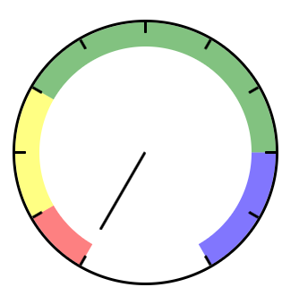

## Gauge

A simple Gauge component with custom options



### Usage:

```html
<html>
  <head>
    ...
    <link rel="stylesheet" href="indicator.css" />
  </head>
  <body>
    <div id="indicator-1"></div>
    <script type="module" src="./gauge.mjs"></script>
    <script type="module">
      import Gauge from "./gauge.mjs";

      (() => {
        const indicatores = [
          {
            fractions: [
              {
                color: "red",
                size: "10%",
                onClick: function () {
                  console.log(`You clicked on ${this.color} with ${this.size}`);
                },
              },
              { color: "yellow", size: "20%" },
              { color: "green", size: "30%" },
              { color: "blue", size: "40%" },
            ],
            value: "15%",
            wrapperElId: "indicator-1",
          },
        ];

        indicatores.forEach((indicator) => {
          const gauge = new Gauge(indicator);
          gauge.render();
        });
      })();
    </script>
  </body>
</html>
```

### Options:

| option         | description                     | default |
| -------------- | ------------------------------- | ------- |
| arcLength      | Arc length                      | 300     |
| borderSize     | Border size                     | 3       |
| fractionLength | Fraction length                 | 60      |
| fractions      | [fractionType[]](#fractionType) | []      |
| markerLength   | Marker length                   | 30      |
| markerStep     | Marker step                     | 30      |
| radius         | Gauge radius                    | 150     |
| value          | Gauge value                     | "0%"    |
| wrapperElId    | Wrapper element id              | ""      |

#### fractionType:

| option  | description | default |
| ------- | ----------- | ------- |
| color   | Color       | ""      |
| size    | Size        | "0%"    |
| onClick | onClick     | null    |

### TODO:

- Rewrite this component to be used as a React Component.
- Let the arrow be customizable
